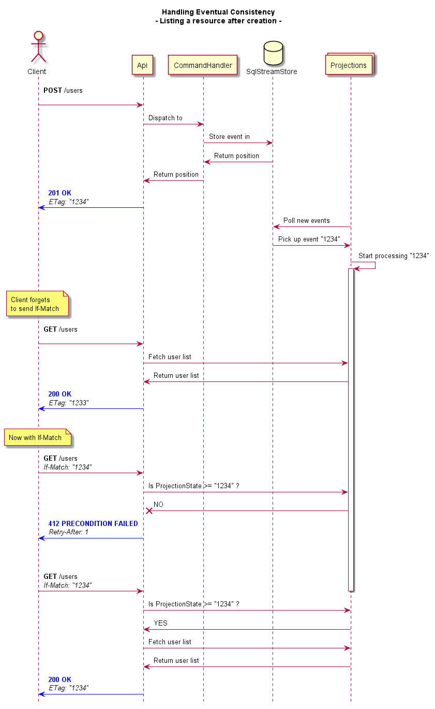
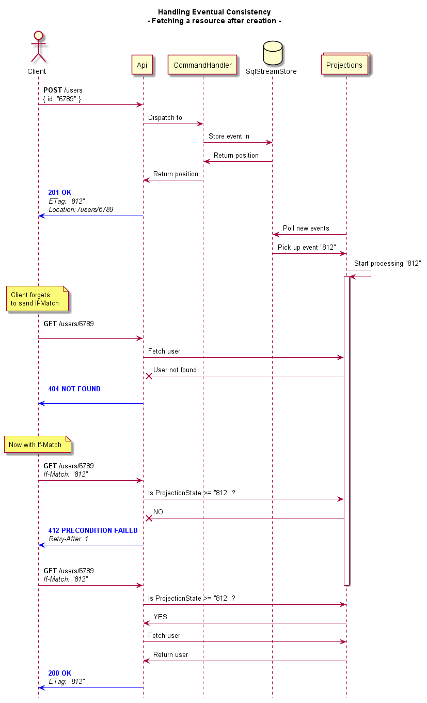

# 13. Use Dutch resource names.

Date: 2017-09-25

## Status

Accepted

## Context

The UI might request a resource after it's creation or alteration, while the async projections are not yet up to date with this change.
In that case, the user would see stale data without knowing why, perhaps thinking its changes were not accepted by the application.

To prevent this, the client needs a mechanism to check whether or not its latest update has already been processed by the projections.

## Decision

We will handle eventual consistency concerns using ETags. On succesful POST or PUT to the API, the client will receive a response containing an ETag header. This header will contain the highest event number caused by the client's request.

All Projections will update their ProjectionState with this number.

If a client wants to know if the resource is up to date with their changes, they will have to include the ETag in a `If-Match` header. Depending on whether the Projections is up to date or not, the API will return a `200 OK` or `412 PRECONDITION FAILED`.

## Consequences

We will document the sequence flows for getting and listing resources.

Clients will have to be informed of this flow.

